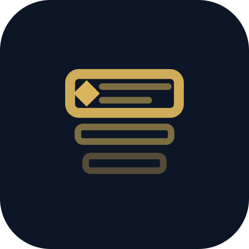
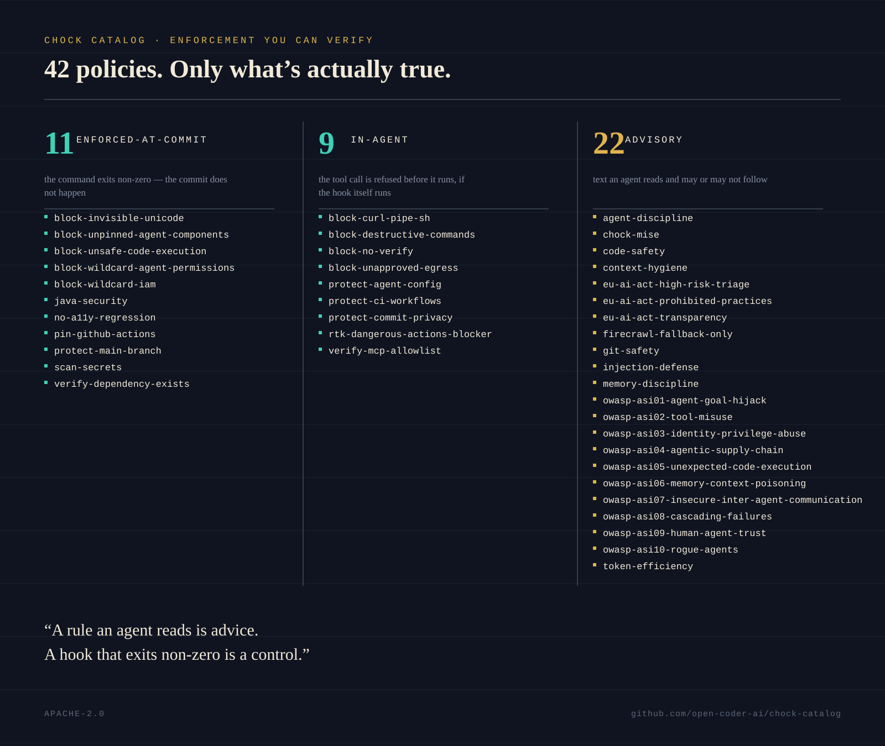
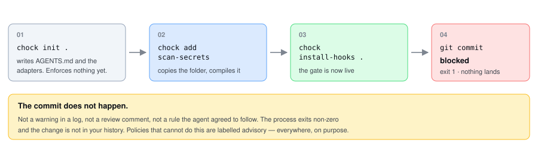
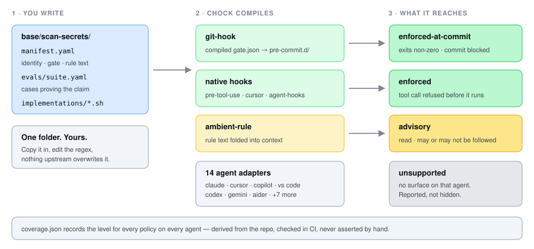

<div align="center">



<h1>chock-catalog</h1>

<p><strong>Policies that stop your coding agent from doing the thing you would have caught in review.</strong></p>

<p>


</p>

<p>
<a href="#the-policies">The policies</a> ·
<a href="#it-actually-blocks-the-commit">See it block</a> ·
<a href="#the-content-is-yours">Customising</a> ·
<a href="#contributing">Contributing</a> ·
<a href="https://github.com/open-coder-ai/chock">the framework →</a>
</p>

</div>

Your agent is fast, tireless, and occasionally commits an AWS key. Prompting it not to works
until the context fills up. This is the part that does not depend on the model paying
attention.

```bash
chock add scan-secrets
chock sync .
```

That is the whole install. The next commit containing a credential exits non-zero.

---

## The policies

**A rule an agent reads is advice. A hook that exits non-zero is a control.** Both belong in
a repo, and the difference has to be visible, because the failure mode of governance tooling
is that everyone believes it is doing more than it is. So every policy here is labelled with
what it actually reaches — stated up front rather than in the appendix, because twenty of
thirty-six are advisory, and that is the number most catalogs would round up:

| | What it means | How many |
| :--- | :--- | ---: |
| `enforced-at-commit` | the command exits non-zero, the commit does not happen | 9 |
| `enforced` | the tool call is refused before it runs | 7 |
| `advisory` | text an agent reads and may or may not follow | 20 |



Advisory eval cases report as `skipped`, never as passing, because there is no mechanism to
replay.

**Enforced at commit** — declarative gates, verified by replaying their own gate against a
throwaway repo on every push.

| Policy | Blocks | Evals |
| :--- | :--- | ---: |
| [`protect-main-branch`](docs/protect-main-branch/) | commits and pushes to `main`/`master` | 4/4 |
| [`scan-secrets`](docs/scan-secrets/) | credentials in staged changes | 20/20 |
| [`verify-dependency-exists`](docs/verify-dependency-exists/) | packages absent from your allowlist | 5/5 |
| [`block-invisible-unicode`](docs/block-invisible-unicode/) | bidi-override and tag-block Unicode in staged changes -- Trojan Source and instructions hidden from reviewers but legible to agents | 8/8 |
| [`block-wildcard-agent-permissions`](docs/block-wildcard-agent-permissions/) | committed everything-grants -- bare-wildcard shell grants and allow-everything tool lists -- that hand an agent unlimited tool authority | 11/11 |
| [`pin-github-actions`](docs/pin-github-actions/) | a workflow that references a third-party GitHub Action by a movable tag or branch instead of a full commit SHA -- so a re-tagged or compromised release can't change what CI runs; SHA pins and local actions pass | 9/9 |

**Enforced before the tool runs** — guard scripts consulted before the agent executes a
command, natively wired in Claude Code, Cursor, Copilot CLI and VS Code (and, via the
codex plugin format, Codex after its per-hook trust review).

| Policy | Refuses | Evals |
| :--- | :--- | ---: |
| [`block-destructive-commands`](docs/block-destructive-commands/) | `rm -rf /`, force push, hard reset, `terraform destroy`, `dropdb`, `helm uninstall`, `docker volume rm`, `aws s3 rm --recursive`, `gcloud … delete` | 42/42 |
| [`block-no-verify`](docs/block-no-verify/) | `--no-verify`, which bypasses every gate above | 17/17 |
| [`protect-agent-config`](docs/protect-agent-config/) | shell edits to the agent's own instruction, permission and enforcement files (now including the policy guard sources themselves) -- self-modification refused up front | 24/24 |
| [`protect-commit-privacy`](docs/protect-commit-privacy/) | commit messages and `gh pr create`/`edit` bodies that narrate the development conversation (or leak a session link) instead of describing the change — a leak class that only exists once an agent authors the commit | 20/20 |
| [`block-curl-pipe-sh`](docs/block-curl-pipe-sh/) | piping a network download into a shell or script interpreter — `curl … \| sh`, `wget … \| bash`, `curl … \| python`, `bash -c "$(curl …)"`, `iwr … \| iex` — while download-to-file and pipes into non-interpreter tools stay allowed | 27/27 |
| [`protect-ci-workflows`](docs/protect-ci-workflows/) | shell writes to the CI/CD config that gates a change — `.github/workflows/`, `.github/actions/`, `.github/dependabot.yml` — so an agent can't delete or loosen the checks reviewing its own work; reads and `chock sync` pass | 19/19 |
| [`block-unapproved-egress`](docs/block-unapproved-egress/) | a network client that uploads data — `curl -d`/`-F`/`--upload-file`, `-X POST`, `wget --post-file`, `Invoke-WebRequest -Method POST` — to a host outside the egress allowlist; fetch-only traffic and `pip install` pass. A tool-time floor, not a network sandbox | 29/29 |

**Advisory** — rule text compiled into agent context. No mechanism, no executed evals.

[`agent-discipline`](docs/agent-discipline/) · [`code-safety`](docs/code-safety/) ·
[`context-hygiene`](docs/context-hygiene/) · [`git-safety`](docs/git-safety/) ·
[`injection-defense`](docs/injection-defense/) ·
[`memory-discipline`](docs/memory-discipline/) · [`token-efficiency`](docs/token-efficiency/)

**Compliance** — jurisdiction-specific, in `compliance/` rather than `base/`. Everything
above applies to any repo; these only earn their place if the regulation reaches you.

| Policy | Covers | In force |
| :--- | :--- | :--- |
| [`eu-ai-act-transparency`](docs/eu-ai-act-transparency/) | EU AI Act Art 50 — AI disclosure, machine-readable marking of synthetic output, deepfake labelling | now |
| [`eu-ai-act-prohibited-practices`](docs/eu-ai-act-prohibited-practices/) | Art 5 — social scoring, face scraping, workplace emotion inference, NCII/CSAM | now |
| [`eu-ai-act-high-risk-triage`](docs/eu-ai-act-high-risk-triage/) | Annex III domains, Articles 9–15 | 2027-12-02 |

Advisory, like everything else with no mechanism. Regulatory scoping is judgement, and a
keyword gate here would block on `emotion_recognition` in a comment.

**Agentic security** — the OWASP Top 10 for Agentic Applications (2026), in
`agentic-security/`. One policy per ASI category. These govern the agentic system you are
*building*; everything above governs the agent doing the building. They only earn their
place if your repo ships agents that plan, call tools, persist memory, or coordinate.

| Policy | Guards against |
| :--- | :--- |
| [`owasp-asi01-agent-goal-hijack`](docs/owasp-asi01-agent-goal-hijack/) | untrusted content redirecting the agent's goal or tool scope |
| [`owasp-asi02-tool-misuse`](docs/owasp-asi02-tool-misuse/) | excess agency, parameter abuse, unsafe tool chains |
| [`owasp-asi03-identity-privilege-abuse`](docs/owasp-asi03-identity-privilege-abuse/) | borrowed credentials, shared accounts, long-lived broad tokens |
| [`owasp-asi04-agentic-supply-chain`](docs/owasp-asi04-agentic-supply-chain/) | unverified MCP servers, frameworks, runtime-discovered tools |
| [`owasp-asi05-unexpected-code-execution`](docs/owasp-asi05-unexpected-code-execution/) | generated code escaping its sandbox; untrusted strings reaching an interpreter |
| [`owasp-asi06-memory-context-poisoning`](docs/owasp-asi06-memory-context-poisoning/) | poisoned durable memory steering later sessions |
| [`owasp-asi07-insecure-inter-agent-communication`](docs/owasp-asi07-insecure-inter-agent-communication/) | peer impersonation, tampering, replay, fake discovery |
| [`owasp-asi08-cascading-failures`](docs/owasp-asi08-cascading-failures/) | one agent's bad output propagating through downstream automation |
| [`owasp-asi09-human-agent-trust`](docs/owasp-asi09-human-agent-trust/) | approval surfaces the agent itself authors |
| [`owasp-asi10-rogue-agents`](docs/owasp-asi10-rogue-agents/) | drifted, compromised, or uninventoried agents |

Advisory, and for the same reason: whether a tool grant is "least agency" is a judgement
about your architecture, not a pattern a gate can match. Three of these deliberately overlap
`injection-defense`, `code-safety`, and `memory-discipline` — those govern your coding
agent's own session, these govern the product it writes.

Three ASI categories do have a slice a diff can literally show, and those slices get real
gates — narrow siblings named for exactly what they block, so the advisory policy never
claims an enforcement it does not have:

| Gate | Blocks | Slice of | Evals |
| :--- | :--- | :--- | ---: |
| [`block-unsafe-code-execution`](docs/block-unsafe-code-execution/) | bare `eval`/`exec`, `shell=True`, unsafe deserialization | ASI05 | 7/7 |
| [`block-wildcard-iam`](docs/block-wildcard-iam/) | `"Action": "*"`, `AdministratorAccess`, `roles/owner` | ASI03 | 6/6 |
| [`block-unpinned-agent-components`](docs/block-unpinned-agent-components/) | `npx -y server@latest`, `:latest` images | ASI04 | 6/6 |

The pattern is the same one `base/` uses: `code-safety` advises broadly while
`scan-secrets` blocks narrowly. The gate is not the rule promoted — it is the greppable
fraction, enforced honestly, with the judgement half still labelled advisory.

Every policy has [its own page](docs/) — what it solves, how it works, which primitive it
becomes, and what is safe to change.

---

## It actually blocks the commit

Output from a real repository, captured by running these commands in `/tmp/demo-repo` — not
written to look like it was. Two things are elided and marked `…`: absolute paths, and the
resolved catalog commit `add` prints, which changes with every commit to this repo.
Everything else is exactly what the tool wrote.

```console
$ chock init .
Installed pre-commit dispatcher to …/.git/hooks/pre-commit
No git-pre-commit.sh policies found; pre-commit dispatcher unchanged
Installed pre-push dispatcher to …/.git/hooks/pre-push
No git-pre-push.sh policies found; pre-push dispatcher unchanged
INDEX.md: ~267 tokens (chars/4, max 2000)
Implementation registered at …/.git/hooks/pre-commit.d/99-chock-validate
[PASS] All checks passed.
Initialized Chock in /tmp/demo-repo
Agents: AGENTS.md + claude, copilot, gemini
Skills: eval, optimize, policy-init, validate (refresh with `chock install-skills .`)
Policies: none. This repo enforces nothing yet.
  1. copy a policy folder from https://github.com/open-coder-ai/chock-catalog (base/<id>/) into .agents/policies/<id>/
  2. chock sync --repo .
Verify anytime with:  chock check --only verify

$ chock add scan-secrets
Added scan-secrets to .agents/policies/scan-secrets
  from https://github.com/open-coder-ai/chock-catalog at …
  sha256 bc9379cc268a62ead90356de6a560d76136c8b5403ae5767d7e6815792a9b4a8
  (unpinned: this was the default branch. Pin with --ref, or --verify-sha bc9379cc…)
INDEX.md: ~329 tokens (chars/4, max 2000)
Compiled. Run `chock sync .` to activate commit-time enforcement.

$ chock add protect-main-branch
Added protect-main-branch to .agents/policies/protect-main-branch
  from https://github.com/open-coder-ai/chock-catalog at …
  sha256 89f29f76bdca8d652f8cb6ef53b6aa7b8e98189399c5218ff19e7ee00e7bb28f
  (unpinned: this was the default branch. Pin with --ref, or --verify-sha 89f29f76…)
INDEX.md: ~366 tokens (chars/4, max 2000)
Compiled. Run `chock sync .` to activate commit-time enforcement.

$ chock sync .
Relocated existing pre-commit to pre-commit.d/00-preexisting
Installed pre-commit dispatcher to …/.git/hooks/pre-commit
Registered 2 pre-commit policy implementation(s)
Relocated existing pre-push to pre-push.d/00-preexisting
Installed pre-push dispatcher to …/.git/hooks/pre-push
Registered 1 pre-push policy implementation(s)
```

Those `sha256` lines are the point of `add` printing them: pass one back as `--verify-sha`
and the next install refuses anything that does not hash to it.

Now try to commit a secret, on a feature branch:

```console
$ git commit -m "add config"
Potential secret detected in staged changes. Remove credentials and rotate any exposed keys. Add '# pragma: allowlist secret' on the same line only for documented test fixtures.
  - config.py: content pattern
# exit 1
```

Remove the key, change nothing else:

```console
$ git commit -m "read key from env"
[PASS] All checks passed.
[feat/config b41f46e] read key from env
 1 file changed, 2 insertions(+)
 create mode 100644 config.py
# exit 0
```

And on `main`:

```console
$ git checkout main && git commit -m notes
Direct commits/pushes to a protected branch (main|master) are blocked. Create a feature branch and open a pull request.
  - main
# exit 1
```

The protected branches in that message are not hard-coded — they are the ones the gate is
actually enforcing. Set `chock.defaults.protected_branches` to
`[main, master, release/*]` and the same commit on `release/1.0` reports
`(main|master|release/*)`. A block message that names a different set from the gate is how
an adopter learns to distrust the tool.

Note the third block. The gate is not "block everything scary" — it passed the moment the
secret was gone. A guard that cannot be satisfied gets disabled within a week.



---

## Why this instead of a prompt

You have already told your agent not to commit secrets. It agreed. Then the session got
long, the instruction moved to the middle of the context window, and it did it anyway.

Gates run in **git**, so they hold no matter which agent — or which human — is at the
keyboard. And where a policy cannot reach an agent, `coverage.json` says `unsupported`
rather than quietly omitting the row — an understated number is the same failure as an
overstated one.

---

## How it works

One folder per policy. `manifest.yaml` declares identity and either a gate or rule text;
`chock sync` turns that into artifacts for whichever agents you use.



The same policy reaches different levels on different agents, and `coverage.json` records
every pair.

---

## Works with the agent you already use

Thirteen adapters, generated from one `AGENTS.md`. The rules live in one place; the adapters
exist because agents look for different filenames.

`claude` · `copilot` · `cursor` · `gemini` · `codex` · `aider` · `windsurf` · `devin` ·
`grok` · `kimi-code` · `replit` · `tabnine` · `vscode`

```bash
chock init . --agent-agnostic   # generate all of them
chock init . --agents cursor    # or just yours
```

---

## The content is yours

```bash
cp -r base/scan-secrets  <your-repo>/.agents/policies/scan-secrets
cd <your-repo> && chock sync --repo .
```

Copying the folder produces **byte-identical** compiled output to `chock add` — there
is no registration step and nothing `add` does that a copy misses. Then edit it. `recompile`
reads your copy as the source, so a changed regex reaches the compiled gate and changes what
gets blocked.

Nothing upstream overwrites your version. That is the entire reason these live outside the
framework: a bundled policy is one the framework owns and replaces on upgrade, which makes
customisation impossible.

Add your own token formats. Loosen a threshold. Delete the rules you disagree with.

---

## This repo runs what it publishes

The catalog is a Chock adopter. `.agents/policies/` holds every `base/` policy — the
catalog protects itself the same way it asks any open-source repo to — and the first
commit after adoption was rejected by `protect-main-branch`. One is installed but
disabled with its reasons written in `.chock/config.yaml`: `verify-dependency-exists`
watches dependency manifests this repo does not have.

That is not a flourish. A worked example that is a repository cannot drift from the
instructions the way a README snippet does — and running it has already found four framework
bugs that no test caught, including a freshness check whose verdict depended on the caller's
working directory and an `add` that could not see this catalog's newest tree.

CI keeps two things apart on purpose: **what this repo runs** (the `base/` tier — the
compliance and agentic-security packs stay uninstalled because, by their own doctrine,
they only earn their place where they apply, and this repo ships no agentic system and
falls under no covered regulation) and **what this repo ships** (every published policy,
staged into a throwaway repo the way an adopter installs them). A catalog should still
publish more than it is bound by, and [the reasoning is written down](docs/).

## OWASP Agentic Security coverage — scored by the tool, not the README

The [`agentic-security/`](agentic-security/) tree covers **every control in the OWASP Top 10
for Agentic Applications** (ASI01–ASI10): **10/10 controls covered · 0 fully covered.**

That number is not written here by hand. CI re-derives it on every build: the staged adopter
repo installs every published policy and runs the same command you can —

```bash
chock init . && chock add owasp-asi01-agent-goal-hijack   # ... through asi10
chock compliance report --framework owasp_asi
```

The same report also speaks `mitre_atlas`, `nist_ai_rmf` and `eu_ai_act` — policies here
claim technique- and article-level controls, and every claim is `partial` with a note
saying exactly what the mechanism reaches.

— and the build fails if any control reads `uncovered`. Every row reads `partial`, because
most of the pack is advisory (rules and skills the agent reads) rather than deterministic
gates, and this tool refuses to label advisory coverage as more than it is. Three hard guards
(`block-unsafe-code-execution`, `block-wildcard-iam`, `block-unpinned-agent-components`)
upgrade specific attack classes to commit-time enforcement. `full` means runtime enforcement,
and rows will only say it when that mechanism exists — the report prints every gap precisely
so nobody has to take our word for anything.

---

## Every policy here is an Agent Plugin

[Agent Plugins 1.0.0](https://agent-plugins.org) is the packaging standard published in August 2026
by OpenAI, Microsoft, Amazon, Cursor and Vercel, with Google as a core maintainer. Each
`base/<id>/` folder is a conformant plugin directory — `plugin.json` at its root, the policy's rule
text at `skills/<id>/SKILL.md` — so any client implementing the spec can read these policies
without Chock installed at all.

**That is a portability claim, not an enforcement one.** The standard covers skills and MCP
servers; it defines no enforcement mechanism, and hooks are explicitly deferred until their formats
converge. A policy read as a plugin is `advisory` — the same tier as the twenty advisory rows above
— and every generated `SKILL.md` says so in its own body. The `enforced-at-commit` policies
get their teeth from `chock sync`, not from the package. Enforcement *does* travel in the
four hook-carrying vendor formats (`chock plugin build --format claude|copilot|cursor|codex`),
published in the per-vendor repos:
[claude](https://github.com/open-coder-ai/chock-claude-plugins),
[copilot](https://github.com/open-coder-ai/chock-copilot-plugins),
[cursor](https://github.com/open-coder-ai/chock-cursor-plugins),
[codex](https://github.com/open-coder-ai/chock-codex-plugins) — each witnessed denying
a destructive command on a real install.

Both files are generated from `manifest.yaml`, which stays the source of truth, and CI fails if
they drift from it.

---

## Contributing

Good first contributions, roughly in order of usefulness:

1. **Turn an advisory policy into an enforced one.** Twenty policies are text today. Any one
   of them that can be expressed as a `content_regex`, `forbidden_ref` or
   `dependency_allowlist` gate is a strict upgrade — and the eval suite already describes the
   behaviour you would need to satisfy.
2. **Add token formats to `scan-secrets`.** Every vendor has a prefix. Generic scanners miss
   the internal ones.
3. **Extend `block-destructive-commands`** with the commands your stack actually has —
   `helm uninstall`, `aws s3 rm --recursive`, `dropdb`.
4. **Write a policy for your domain.** `chock init` installs a `policy-init` skill;
   ask your agent to run it and it scaffolds a conformant folder.

Two rules, both mechanical:

- **A policy claims only what it can do.** If it does not exit non-zero, it is advisory, and
  the tooling will label it that way whatever the manifest says.
- **Evals are the argument.** A gate whose declared behaviour does not match its suite fails
  CI, and derived cases alone are not enough — attestation needs at least one authored case
  that could have failed.

```bash
git clone https://github.com/open-coder-ai/chock-catalog
cd chock-catalog
chock check          # conformance
chock check --only evals       # replay every gate
```

Issues and PRs welcome, including "this policy is wrong". Especially that one — an
overstated policy is worse here than a missing one. Full guide in
[CONTRIBUTING.md](CONTRIBUTING.md).

---

## Installing this is running code

A policy here is not inert data. Its `implementations/*.sh` becomes a git hook that runs on
every commit and a guard consulted before your agent executes a command, so `chock add`
installs executable content over `git clone`. There is no signing key. Pin and verify when the
catalog is not one you control:

```bash
chock add scan-secrets --ref v1.0.0 --verify-sha <sha256>
```

Two more limits worth knowing before you rely on any of this: `git commit --no-verify` skips
every git hook, and git hooks are not cloned — a fresh clone enforces nothing until someone
runs `chock sync`. [SECURITY.md](SECURITY.md) has the rest.

---

## Related

- [**chock**](https://github.com/open-coder-ai/chock) — the framework. Ships
  mechanism only and bundles no policies, which is why this repo exists.

Apache-2.0 — see [LICENSE](LICENSE). Contributor Covenant
[Code of Conduct](CODE_OF_CONDUCT.md).
